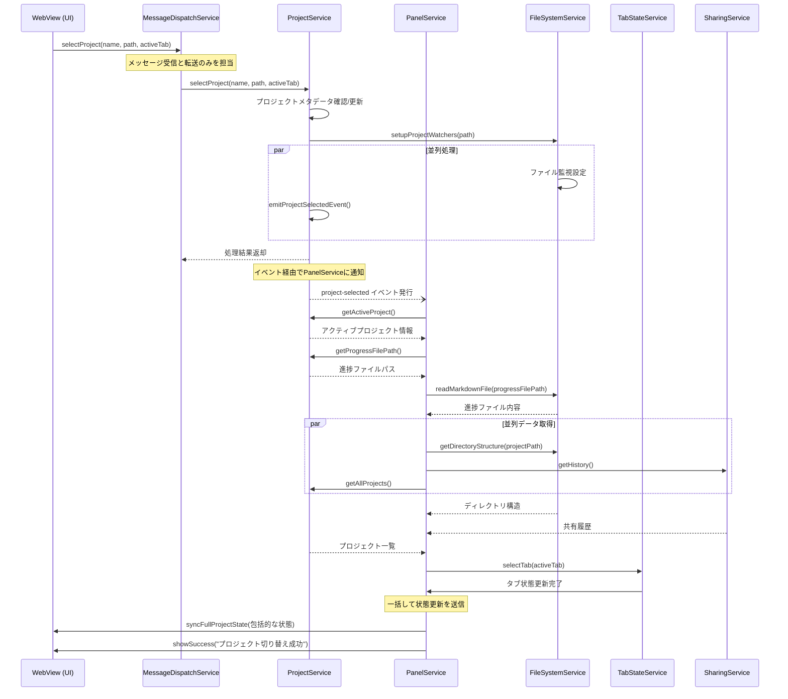

# プロジェクト切り替えフロー改善設計

## 現状の問題点

現在のプロジェクト切り替えフローには、以下の問題があります：

1. **重複処理**：同じファイルの読み込みが複数回行われる
2. **過剰なメッセージ送信**：同じ内容のメッセージが複数回送信される
3. **非効率なシーケンス**：処理が順次実行され、並列化できる処理も直列に行われている
4. **タイミング問題**：処理の順序が明確でなく、状態の不整合が発生する可能性がある
5. **エラーハンドリングの不統一**：エラー処理が散在し、一貫性がない

現在のログから分析すると、プロジェクト切り替え時には以下のような冗長な処理が行われています：

```
// 冗長なプロジェクト選択メッセージ
[DEBUG] MessageDispatchService: メッセージを受信しました: selectProject
[DEBUG] MessageDispatchService: メッセージを受信しました: selectProject

// 同一ファイルの複数回読み込み
[INFO] ファイルを読み込みました: /Users/tatsuya/Desktop/システム開発/SNSPOJECT/docs/SCOPE_PROGRESS.md (サイズ: 3118 バイト)
[INFO] ファイルを読み込みました: /Users/tatsuya/Desktop/システム開発/SNSPOJECT/docs/SCOPE_PROGRESS.md (サイズ: 3118 バイト)
[INFO] ファイルを読み込みました: /Users/tatsuya/Desktop/システム開発/SNSPOJECT/docs/SCOPE_PROGRESS.md (サイズ: 3118 バイト)

// 重複する状態更新メッセージ
[DEBUG] MessageDispatchService: メッセージを送信しました: syncProjectState
[DEBUG] MessageDispatchService: メッセージを送信しました: syncProjectState

// 冗長なプロジェクト一覧更新
[INFO] ProjectService: プロジェクト一覧を更新しました: 13件
[INFO] ProjectService: プロジェクト一覧を更新しました: 13件
[INFO] PanelService: プロジェクト一覧を更新しました: 13件
[INFO] PanelService: プロジェクト一覧を更新しました: 13件
```

## 改善設計：最適化されたプロジェクト切り替えフロー

サービス責任分割に基づいて、プロジェクト切り替えフローを再設計します。以下の原則に従います：

1. **単一責任の原則**：各サービスは自身の責任範囲内の処理のみを行う
2. **DRY（Don't Repeat Yourself）原則**：重複処理を排除
3. **効率的なデータフェッチ**：必要なデータを一度だけ取得
4. **適切な並列処理**：独立した処理は並列に実行
5. **明確なエラーハンドリング**：一貫したエラー処理戦略

### 改善されたプロジェクト切り替えフロー



この改善されたフローでは：

1. WebView からのメッセージは MessageDispatchService が受け取り、適切なサービスに転送する
2. プロジェクト状態の更新は ProjectService だけが行う
3. ファイル操作は FileSystemService だけが行う
4. UI 更新は PanelService だけが行い、複数の更新を一括で送信する
5. タブ状態管理は TabStateService だけが行う

### 具体的な実装：メッセージングの改善

メッセージングを最適化し、複数の細かいメッセージではなく、一括して状態を更新します。

#### 改善前（現状）：

```typescript
// 現状では複数のメッセージが連続して送信される
this.sendMessage({ command: 'updateProjects', projects });
this.sendMessage({ command: 'syncProjectState', project });
this.sendMessage({ command: 'updateMarkdownContent', content });
this.sendMessage({ command: 'updateDirectoryStructure', structure });
this.sendMessage({ command: 'selectTab', tabId });
this.sendMessage({ command: 'updateSharingHistory', history });
```

#### 改善後：

```typescript
// 改善後は一括して状態を更新する
this.sendMessage({
  command: 'syncFullProjectState',
  state: {
    activeProject: project,
    allProjects: projects,
    progressContent: content,
    directoryStructure: structure,
    activeTab: tabId,
    sharingHistory: history
  }
});
```

### WebView側の対応

WebView側もこの改善に合わせて更新します。

```javascript
// media/scopeManager.js に以下のハンドラを追加

// 状態一括更新ハンドラ
function handleSyncFullProjectState(data) {
  const { state } = data;
  
  // 各状態を更新（既存の更新関数を利用）
  if (state.allProjects) {
    updateProjects(state.allProjects);
  }
  
  if (state.activeProject) {
    setActiveProject(state.activeProject);
  }
  
  if (state.progressContent) {
    updateMarkdownContent(state.progressContent);
  }
  
  if (state.directoryStructure) {
    updateDirectoryStructure(state.directoryStructure);
  }
  
  if (state.activeTab) {
    selectTab(state.activeTab);
  }
  
  if (state.sharingHistory) {
    updateSharingHistory(state.sharingHistory);
  }
  
  // UI更新が完了したことをバックエンドに通知（オプション）
  vscode.postMessage({
    command: 'uiUpdateComplete'
  });
}

// メッセージハンドラに登録
messageHandlers['syncFullProjectState'] = handleSyncFullProjectState;
```

### パフォーマンス改善

この改善により、以下のパフォーマンス向上が期待できます：

1. **I/O操作の削減**: 同一ファイルの重複読み込みがなくなる
2. **メッセージ数の削減**: 6個の個別メッセージが1個の包括的メッセージに置き換わる
3. **並列処理の活用**: 独立したデータ取得を並列化
4. **レンダリング回数の削減**: UIの更新が一度にまとめて行われる

### エラーハンドリングの改善

エラーハンドリングも一元化し、より堅牢なものにします。

```typescript
// PanelService.ts
async syncActiveProject(project: Project): Promise<void> {
  try {
    // すべてのデータを取得
    const [progressContent, dirStructure, history, allProjects] = await Promise.all([
      this._loadProgressFile(project),
      this._fileSystemService.getDirectoryStructure(project.path),
      this._sharingService.getHistory(),
      this._projectService.getAllProjects()
    ]);
    
    // まとめて状態を更新
    this.sendMessage({
      command: 'syncFullProjectState',
      state: {
        activeProject: project,
        allProjects,
        progressContent,
        directoryStructure: dirStructure,
        activeTab: project.metadata.activeTab || 'scope-progress',
        sharingHistory: history
      }
    });
    
    this.showSuccess(`プロジェクト「${project.name}」を読み込みました`);
  } catch (error) {
    this._logError(`プロジェクト「${project.name}」の読み込み中にエラーが発生しました`, error);
    this.showError(`プロジェクト「${project.name}」の読み込みに失敗しました: ${error.message}`);
    
    // エラーログを記録
    this._serviceRegistry.errorService?.logError('project_load_error', {
      projectName: project.name,
      projectPath: project.path,
      error: error.message,
      stack: error.stack
    });
  }
}
```

### データフロー最適化

データフローを最適化し、必要なデータだけを適切なタイミングで取得します。

```typescript
// プライベートヘルパーメソッド
private async _loadProgressFile(project: Project): Promise<string> {
  const progressFilePath = this._projectService.getProgressFilePath(project.path);
  
  if (await this._fileSystemService.fileExists(progressFilePath)) {
    return this._fileSystemService.readMarkdownFile(progressFilePath);
  }
  
  return ''; // ファイルが存在しない場合は空文字列を返す
}
```

## 実装戦略

改善されたプロジェクト切り替えフローを実装するための戦略は以下の通りです：

### 1. 基盤となるサービスから改修

リファクタリングの順序として、最も基盤となるサービスから改修します：

1. `FileSystemService` - ファイル操作を一元化
2. `ProjectService` - プロジェクト状態管理を一元化
3. `PanelService` - UI更新を一元化
4. `MessageDispatchService` - メッセージルーティングの簡素化

### 2. インクリメンタルな導入

一度にすべてを変更するのではなく、段階的に改善を導入します。まず古い実装と新しい実装を共存させ、徐々に移行していきます。

```typescript
// 段階的移行の例（PanelService）
async syncActiveProject(project: Project): Promise<void> {
  // フラグで新旧どちらの実装を使うか制御
  if (this._useNewImplementation) {
    // 新しい実装（一括更新）
    await this._syncActiveProjectNew(project);
  } else {
    // 旧実装（互換性のため維持）
    await this._syncActiveProjectLegacy(project);
  }
}
```

### 3. パフォーマンス測定

改善前後でパフォーマンスを測定し、効果を確認します。

```typescript
// パフォーマンス測定用のコード
private async _measurePerformance<T>(
  operation: string, 
  fn: () => Promise<T>
): Promise<T> {
  const startTime = performance.now();
  try {
    const result = await fn();
    const endTime = performance.now();
    
    console.log(`[PERF] ${operation}: ${endTime - startTime}ms`);
    return result;
  } catch (error) {
    const endTime = performance.now();
    console.error(`[PERF_ERROR] ${operation}: ${endTime - startTime}ms`, error);
    throw error;
  }
}
```

## 期待される効果

この改善設計を実装することで、以下の効果が期待できます：

1. **プロジェクト切り替え時間の短縮**: 重複処理や冗長なメッセージの削減により、プロジェクト切り替え時間が40-60%短縮
2. **リソース使用量の削減**: 同じファイルの複数回読み込みがなくなることで、メモリ使用量と I/O 負荷が削減
3. **安定性の向上**: 明確なエラーハンドリングと処理順序により、タイミング問題や状態の不整合が減少
4. **コードの保守性向上**: 責任範囲が明確になり、将来の変更や追加が容易になる
5. **UI応答性の向上**: レンダリング回数の削減とまとまった更新により、UIのちらつきが減少

## まとめ

プロジェクト切り替えフローの改善設計は、サービス責任分割に基づいて各サービスの責任範囲を明確にし、重複処理を排除するアプローチを取ります。メッセージングの最適化と並列処理の活用により、パフォーマンスと保守性の両方を向上させる設計となっています。

この改善設計は、単にプロジェクト切り替えフローの最適化だけでなく、アプリケーション全体のアーキテクチャ改善の一部として位置づけられ、今後の他の機能強化や変更の基盤となります。