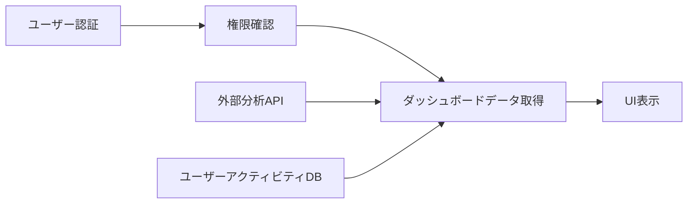

# 現在の実装スコープ: ダッシュボード機能

## 1. 基本情報

- **スコープID**: DASH-001
- **優先度**: 高
- **担当**: スコープ実装アシスタント (#11)
- **ステータス**: 実装中 (65% 完了)
- **開始日**: 2025-05-10
- **目標完了日**: 2025-05-20
- **前提条件**: 認証システム実装完了
- **完了タスク数**: 7/12
- **進捗率**: 58.3%
- **最終更新日**: 2025-05-16

## 2. 実装概要

ダッシュボード機能は、ユーザーがシステム全体の主要指標を一目で把握できるようにするための中心的な機能です。各種メトリクスの視覚化、最近のアクティビティの表示、クイックアクションの提供により、ユーザーの意思決定と生産性を向上させます。

## 3. 参照ドキュメント

- **要件定義**: [requirements.md#dashboard-section](/docs/requirements.md#dashboard-section)
- **モックアップ**: [dashboard.html](/mockups/dashboard.html)
- **API仕様**: [dashboard-api.md](/docs/api/dashboard-api.md)
- **型定義**: [Dashboard/AdminUser型](/shared/index.ts#L150-L190)
- **実装ガイド**: [dashboard-implementation-guide.md](/docs/implementation/dashboard-implementation-guide.md)

## 4. 依存関係

- **前提となる機能**: 認証システム、ユーザー管理、基本データモデル
- **影響を与える機能**: レポート機能、通知システム、ユーザー設定
- **外部サービス依存**: チャートライブラリ (ECharts)、分析API

## 5. データフロー



## 6. タスクリスト

### バックエンド実装

- [x] **BE-1**: ダッシュボードデータ取得APIエンドポイント実装 
  - 完了日: 2025-05-12
  - 担当: バックエンド実装エージェント (#7)
  - 参照: [dashboard.controller.ts](/server/src/controllers/dashboard.controller.ts)
  - 型定義: [DashboardResponse](/shared/index.ts#L520-L545)
  - テスト: [dashboard.test.ts](/server/src/tests/api/dashboard.test.ts)

- [x] **BE-2**: データ集計サービス実装
  - 完了日: 2025-05-14
  - 担当: データモデル統合エージェント (#4)
  - 参照: [aggregation.service.ts](/server/src/services/aggregation.service.ts)
  - 型定義: [AggregationResult](/shared/index.ts#L550-L570)
  - サブタスク:
    - [x] 2.1 基本集計ロジックの実装
    - [x] 2.2 キャッシュ最適化
    - [x] 2.3 エラー処理

- [x] **BE-3**: 権限ベースのデータフィルタリング実装
  - 完了日: 2025-05-15
  - 担当: バックエンド実装エージェント (#7)
  - 参照: [dashboard.filter.ts](/server/src/services/dashboard.filter.ts)
  - 型定義: [UserRole](/shared/index.ts#L136-L140)

- [~] **BE-4**: リアルタイム更新メカニズム実装
  - 目標: 2025-05-18
  - 担当: バックエンド実装エージェント (#7)
  - 参照: [dashboard.realtime.ts](/server/src/services/dashboard.realtime.ts)
  - 型定義: [RealtimeEvent](/shared/index.ts#L580-L595)
  - サブタスク:
    - [x] 4.1 イベントモデル設計
    - [ ] 4.2 WebSocket実装
    - [ ] 4.3 認証統合

### フロントエンド実装

- [x] **FE-1**: ダッシュボードコンポーネント作成
  - 完了日: 2025-05-13
  - 担当: フロントエンド実装エージェント (#6)
  - 参照: [Dashboard.tsx](/client/src/components/Dashboard.tsx)
  - 型定義: [DashboardProps](/shared/index.ts#L580-L590)

- [x] **FE-2**: APIとの連携実装
  - 完了日: 2025-05-14
  - 担当: フロントエンド実装エージェント (#6)
  - 参照: [dashboard.service.ts](/client/src/services/dashboard.service.ts)
  - 型定義: [ApiResponse<DashboardResponse>](/shared/index.ts#L219)

- [~] **FE-3**: インタラクティブチャート実装
  - 目標: 2025-05-17
  - 担当: フロントエンド実装エージェント (#6)
  - 参照: [DashboardCharts.tsx](/client/src/components/dashboard/DashboardCharts.tsx)
  - 型定義: [ChartData](/shared/index.ts#L600-L615)
  - サブタスク:
    - [x] 3.1 基本グラフ実装
    - [x] 3.2 データバインディング
    - [ ] 3.3 インタラクション実装
    - [ ] 3.4 レスポンシブ対応

- [ ] **FE-4**: ダッシュボードカスタマイズ機能
  - 目標: 2025-05-19
  - 担当: フロントエンド実装エージェント (#6)
  - 参照: [DashboardCustomize.tsx](/client/src/components/dashboard/DashboardCustomize.tsx)
  - 型定義: [DashboardLayout](/shared/index.ts#L620-L640)
  - ブロッカー: FE-3の完了待ち

### テストとドキュメント

- [x] **TEST-1**: バックエンドAPI統合テスト
  - 完了日: 2025-05-15
  - 担当: テスト&品質エージェント (#8)
  - 参照: [dashboard-api.test.ts](/server/src/tests/integration/dashboard-api.test.ts)

- [ ] **TEST-2**: フロントエンドE2Eテスト
  - 目標: 2025-05-19
  - 担当: テスト&品質エージェント (#8)
  - 参照: [dashboard.e2e.ts](/tests/e2e/dashboard.e2e.ts)
  - ブロッカー: FE-3とFE-4の完了待ち

- [ ] **DOC-1**: ユーザードキュメント更新
  - 目標: 2025-05-20
  - 担当: APIデザイナー (#4)
  - 参照: [dashboard-user-guide.md](/docs/user/dashboard-user-guide.md)
  - ブロッカー: 全機能の完了待ち

## 7. 実装上の注意点

- 権限チェックを各APIエンドポイントで徹底すること
- データ集計は非同期処理で実行し、UI応答性を維持すること
- チャートコンポーネントはモバイル対応を考慮すること
- バックエンド/フロントエンド間の型の整合性を保つため、必ず`shared/index.ts`の型定義を参照すること
- メトリクス計算のパフォーマンスを最適化し、大規模データセットでも応答時間を3秒以内に抑えること

## 8. リスク管理

| リスク | 影響度 | 発生確率 | 対策 | ステータス |
|-------|--------|---------|------|----------|
| 大量データ時のパフォーマンス低下 | 高 | 中 | キャッシュ層の追加と段階的データロード | 対策済み |
| リアルタイム更新の認証問題 | 中 | 高 | JWT検証とユーザーセッション管理の強化 | 対応中 |
| チャートライブラリの互換性問題 | 中 | 低 | フォールバックレンダリング方式の実装 | 監視中 |
| カスタマイズ設定の保存競合 | 低 | 中 | オプティミスティックUIと競合解決アルゴリズム | 計画中 |

## 9. 開発コマンド集

```bash
# バックエンドテスト実行
cd server && npm run test:api -- --testPathPattern=dashboard

# フロントエンドコンポーネントテスト
cd client && npm run test -- --testPathPattern=Dashboard

# 開発サーバー起動（ダッシュボード開発モード）
npm run dev:dashboard

# ダッシュボードE2Eテスト実行
npm run test:e2e -- --spec dashboard.e2e.ts
```

## 10. エラー引き継ぎログ

【BE-4】リアルタイム更新メカニズム実装
- 問題：WebSocketセッションが認証後に頻繁に切断される
- 試行：
  1. 標準的なKeep-Aliveメカニズムを実装したが解決せず
  2. 認証トークンのリフレッシュタイミングを調整したが部分的にのみ改善
- 現状：
  1. 小規模環境では動作するが、50接続以上で不安定化
  2. 認証トークンとWebSocketセッションの同期に一貫性の問題
- 次のステップ：
  1. メッセージキューイングシステムの導入検討
  2. 永続接続ではなくポーリングベースのフォールバック実装
  3. スケーラブルなWebSocketサービスへの分離
- 参考：[WebSocket認証ベストプラクティス](/docs/architecture/websocket-auth-best-practices.md)

【FE-3】インタラクティブチャート実装
- 問題：複雑なインタラクションが特定のブラウザで動作しない
- 原因：
  1. EChartsのイベントハンドリングがSafariで一部サポートされていない
  2. データ更新時の再レンダリングがメモリリークを引き起こす
- 現状：
  1. Chrome/Firefoxでは正常動作
  2. Safariでは基本機能のみ動作、高度なインタラクションで問題
- 次のステップ：
  1. ブラウザ互換性レイヤーの実装
  2. メモリ使用量最適化のためのコンポーネントライフサイクル見直し
  3. インタラクション機能のプログレッシブエンハンスメント実装
- 参考：[ECharts Browser Compatibility Guide](/docs/frontend/echarts-browser-compatibility.md)

## 11. 実装状況の更新履歴

- **2025-05-16**: FE-3の基本グラフ実装とデータバインディング完了
- **2025-05-15**: BE-3完了、TEST-1完了
- **2025-05-14**: BE-2完了、FE-2完了
- **2025-05-13**: FE-1完了
- **2025-05-12**: BE-1完了
- **2025-05-10**: スコープ実装開始

## 12. 決定事項とオープンな質問

### 決定事項
1. ダッシュボードレイアウトは3カラム構成で実装（2025-05-11）
2. チャートライブラリはEChartsを採用（2025-05-12）
3. リアルタイム更新は1分間隔でポーリング、イベント発生時にWebSocket通知（2025-05-14）
4. メトリクスデータは最大7日分をクライアントにキャッシュ（2025-05-15）

### オープンな質問
1. モバイル版でのチャート表示最適化方法は？
2. ダッシュボード設定のユーザー間共有機能は実装すべきか？
3. 大規模組織（1000+ユーザー）でのパフォーマンス最適化戦略は？
4. オフライン時のダッシュボード機能はどこまでサポートすべきか？