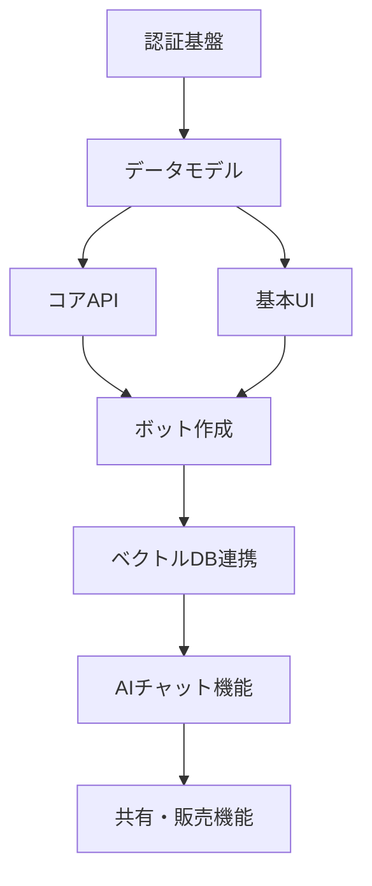

# プロジェクト進捗状況

**作成日**: 2025-05-07
**最終更新日**: 2025-05-07
**ステータス**: 要件定義フェーズ完了

## 1. 開発フェーズ進捗

各開発フェーズの進捗状況を示します。チェックリスト形式でフェーズの完了状況を確認できます。

### 1.1 基本設計フェーズ

- [x] 要件定義 (`docs/requirements.md`)
- [x] 技術スタック選定 (`docs/architecture/tech-stack.md`)
- [ ] システムアーキテクチャ設計
  - [ ] コンポーネント責任分離の設計
  - [ ] 状態管理とイベント処理の設計
- [ ] モックアップ作成
  - [ ] コンポーネント単位のモックアップ構造化
- [ ] データモデル設計
  - [ ] エンティティ間の依存関係と責任境界の明確化

### 1.2 基盤構築フェーズ

- [ ] 環境変数設定
- [ ] 認証システム構築
- [ ] CI/CDパイプライン構築
- [ ] デプロイ設定

### 1.3 実装フェーズ

- [ ] コア機能の実装
- [ ] バックエンドAPI実装
- [ ] フロントエンドUI実装
- [ ] 統合テスト

### 1.4 品質保証フェーズ

- [ ] ユニットテスト実装
- [ ] E2Eテスト実装
- [ ] パフォーマンステスト
- [ ] セキュリティテスト

### 1.5 デプロイフェーズ

- [ ] ステージング環境デプロイ
- [ ] 本番環境デプロイ
- [ ] モニタリング設定
- [ ] 運用ドキュメント作成

## 2. 現在のスコープ: 要件定義完了

### 2.1 完了したドキュメント

- [x] `docs/requirements.md` - プロジェクト要件定義書
- [x] `docs/architecture/tech-stack.md` - 技術スタック選定理由

### 2.2 主要なプロジェクト情報

**プロジェクト名**: AIko
**概要**: ユーザーが特定の人物や自分自身の知識を基にしたカスタムAIチャットボットを作成・共有・販売できるプラットフォーム
**ターゲットユーザー**: 個人、ビジネスユーザー、コンテンツクリエイター

**主要機能**:
- カスタムAIチャットボット作成
- 知識ベースのインポートと管理
- ボットの共有・公開・販売
- ユーザー認証と権限管理
- 課金・決済システム

## 3. 次のステップ: モックアップ作成

### 3.1 タスクリスト

- [ ] モックアップクリエイターによる基本設計レビュー
- [ ] 共通コンポーネントのモックアップ作成
- [ ] ページフローの設計
- [ ] ユーザーインターフェースのモックアップ作成（優先順）:
  - [ ] ランディングページ
  - [ ] ユーザー登録・ログイン
  - [ ] ダッシュボード
  - [ ] ボット作成インターフェース
  - [ ] 知識ベース管理
  - [ ] ボット設定・カスタマイズ
  - [ ] ボット共有・マーケットプレイス
  - [ ] 管理画面

### 3.2 設計方針

- コンポーネント責任分離パターンに従う
- 再利用可能なUIコンポーネントを優先的に設計
- モバイルファーストのレスポンシブデザイン
- アクセシビリティに配慮したUI設計

### 3.3 完了基準

- 全画面のモックアップ作成
- モックアップナビゲーションの実装
- データモデル抽出ドキュメントの作成
- エンドポイント定義の初期ドラフト

## 4. 実装計画概要

### 4.1 優先実装項目

1. 認証基盤
2. データモデル実装
3. コアAPIエンドポイント
4. 基本UI実装
5. ボット作成機能
6. ベクトルDB連携
7. AIチャット機能

### 4.2 実装の依存関係

## 5. 技術的考慮事項

### 5.1 解決すべき技術的課題

- ベクトルデータベースの最適選択（Pinecone vs Qdrant）
- 大量テキストデータの効率的処理方法
- AIレスポンス生成の最適化（品質とコストのバランス）
- リアルタイムチャット機能の実装
- スケーラブルなアーキテクチャ設計

### 5.2 決定事項

| 項目 | 決定内容 | 状態 | 備考 |
|-----|---------|------|------|
| フロントエンドフレームワーク | Next.js | 確定 | App Routerを採用 |
| バックエンドフレームワーク | Node.js + Express | 確定 | TypeScript使用 |
| データベース | MongoDB + Pinecone | 検討中 | ベクトルDBの選定を継続 |
| 認証方式 | JWT + リフレッシュトークン | 確定 | |
| AIプロバイダー | Anthropic Claude | 確定 | 品質優先のため選定 |
| デプロイ環境 | Google Cloud Run | 確定 | 柔軟なスケーリングのため |

## 6. リスク評価

| リスク | 影響度 | 可能性 | 対応策 |
|-------|-------|-------|-------|
| AI処理コストの増大 | 高 | 中 | キャッシング戦略、トークン最適化、料金プラン設計 |
| データプライバシーの懸念 | 高 | 中 | セキュリティ対策の徹底、利用規約の明確化 |
| 競合サービスの登場 | 中 | 高 | 独自機能の開発、ユーザーエンゲージメント強化戦略 |
| 技術的負債の蓄積 | 中 | 中 | コードレビュー徹底、テスト自動化、リファクタリング計画 |
| スケーラビリティ問題 | 高 | 低 | 初期段階からスケーラブルな設計、負荷テスト実施 |

## 7. タイムライン予測

| フェーズ | 予定期間 | 開始予定 | 終了予定 |
|---------|---------|---------|---------|
| モックアップ作成 | 2週間 | 2025-05-07 | 2025-05-21 |
| システムアーキテクチャ設計 | 1週間 | 2025-05-21 | 2025-05-28 |
| データモデル設計 | 1週間 | 2025-05-28 | 2025-06-04 |
| 認証システム実装 | 2週間 | 2025-06-04 | 2025-06-18 |
| コアAPI実装 | 3週間 | 2025-06-18 | 2025-07-09 |
| フロントエンド実装 | 4週間 | 2025-06-18 | 2025-07-16 |
| MVP完成 | - | - | 2025-07-16 |
| テスト・調整 | 2週間 | 2025-07-16 | 2025-07-30 |
| クローズドベータ | 2週間 | 2025-08-01 | 2025-08-15 |
| パブリックベータ | 1ヶ月 | 2025-08-15 | 2025-09-15 |
| 正式リリース | - | - | 2025-10-01 |

## 8. 環境変数リスト

| 変数名 | 説明 | 必須 | 設定状況 |
|--------|------|------|---------|
| `DATABASE_URL` | MongoDB接続URL | はい | 未設定 |
| `JWT_SECRET` | JWT署名キー | はい | 未設定 |
| `ANTHROPIC_API_KEY` | Claude APIキー | はい | 未設定 |
| `VECTOR_DB_API_KEY` | ベクトルDBアクセスキー | はい | 未設定 |
| `VECTOR_DB_URL` | ベクトルDBエンドポイント | はい | 未設定 |
| `STRIPE_SECRET_KEY` | 決済処理用Stripeキー | はい | 未設定 |
| `SMTP_SERVER` | メール送信サーバー | はい | 未設定 |
| `SMTP_USER` | メール送信アカウント | はい | 未設定 |
| `SMTP_PASS` | メール送信パスワード | はい | 未設定 |
| `FRONTEND_URL` | フロントエンドURL | はい | 未設定 |
| `BACKEND_URL` | バックエンドURL | はい | 未設定 |

## 9. 参考資料・ドキュメント

- [要件定義書](/docs/requirements.md)
- [技術スタック](/docs/architecture/tech-stack.md)
- [API設計ガイドライン](/docs/api/index.md) - 作成予定
- [コンポーネント設計原則](/docs/architecture/component-patterns.md) - 作成予定
- [開発ワークフロー](/docs/development-workflow.md) - 作成予定

## 10. 次回更新予定

次回の状況更新は、モックアップ作成フェーズ完了時（2025-05-21予定）に行います。
更新内容：
- モックアップ一式のリンク追加
- データモデル初期設計の追加
- APIエンドポイント一覧の追加
- 実装計画の詳細化