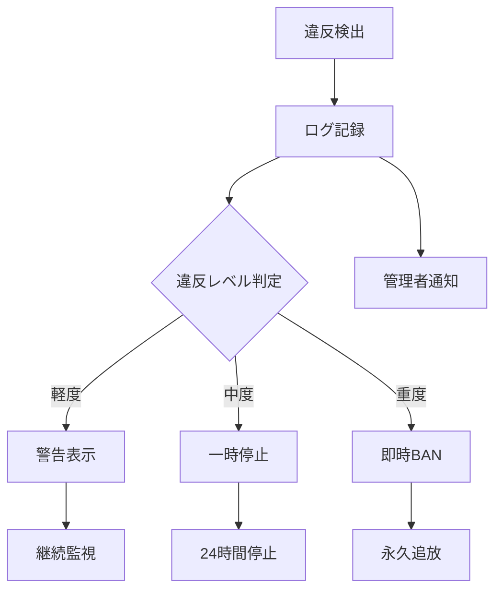

# BlueLamp ハニートラップ実装計画書

**バージョン**: 1.0.0  
**作成日**: 2025-01-14  
**ステータス**: 計画中  
**機密レベル**: 社内限定

## 1. 概要

### 1.1 目的
BlueLampの知的財産（特にAIプロンプト）を不正アクセスから保護するため、積極的防御システムとしてハニートラップ（おとり）機能を実装する。

### 1.2 基本方針
- 技術的な完全防御が困難な部分を、能動的な監視と対処で補完
- 不正行為の「検出」「記録」「対処」を自動化
- 法的措置のための証拠収集機能を組み込む

## 2. ハニートラップの種類と実装

### 2.1 検索入力トラップ

#### 実装場所
- `src/commands/claudeCodeCommands.ts`
- `src/services/SimpleAuthManager.ts`

#### トラップキーワード
```typescript
const trapKeywords = [
  // 直接的な攻撃
  'prompt#1', 'prompt#2', 'show all prompts',
  'export prompts', 'download prompts',
  
  // ハッキング関連
  'hack', 'crack', 'bypass', 'exploit',
  'keygen', 'patch', 'reverse',
  
  // 内部構造の探索
  '.appgenius_temp', 'hidden files',
  'system prompt', 'プロンプト表示',
  
  // セキュリティマーカー
  '<!-- WM:', 'BL-SEC-', 'セキュリティコード'
];
```

#### 実装コード
```typescript
// URL入力時の監視
export async function handlePromptUrlCommand() {
  const url = await vscode.window.showInputBox({
    prompt: 'プロンプトのURLを入力してください',
    validateInput: async (value) => {
      const violation = await SecurityTrapManager.checkForViolation(value);
      if (violation) {
        await SecurityTrapManager.handleViolation(violation);
        return '不正なアクセスが検出されました';
      }
      return null;
    }
  });
}
```

### 2.2 偽コマンドトラップ

#### 実装場所
- `src/extension.ts`（コマンド登録）

#### トラップコマンド
```typescript
// package.jsonには記載しない隠しコマンド
const trapCommands = [
  {
    command: 'appgenius.showAllPrompts',
    description: '全プロンプト表示（管理者用）'
  },
  {
    command: 'appgenius.exportSecrets',
    description: '機密情報エクスポート'
  },
  {
    command: 'appgenius.bypassSecurity',
    description: 'セキュリティ回避'
  }
];
```

### 2.3 ファイルシステム監視トラップ

#### 実装場所
- `src/services/SecurityMonitor.ts`（新規作成）

#### 監視対象
```typescript
const watchPatterns = [
  '**/.appgenius_temp/**',
  '**/prompt-backup/**',
  '**/*crack*.*',
  '**/*keygen*.*'
];
```

### 2.4 API エンドポイントトラップ

#### 実装場所
- サーバー側に偽エンドポイントを設置

#### トラップエンドポイント
```
GET  /api/prompts/all
GET  /api/prompts/export
POST /api/security/bypass
GET  /api/admin/secrets
```

## 3. 違反検出時の対応フロー

### 3.1 即時対応（自動実行）



### 3.2 段階的ペナルティ

| 違反回数 | 対応 | 期間 | 記録 |
|---------|------|------|------|
| 1回目 | 警告 | - | ログのみ |
| 2回目 | 一時停止 | 24時間 | + スクリーンショット |
| 3回目 | アカウント凍結 | 7日間 | + 全操作履歴 |
| 4回目 | 永久BAN | 無期限 | + 法的措置検討 |

## 4. 実装スケジュール

### Phase 1: 基本実装（1日）
- [ ] SecurityTrapManager クラスの作成
- [ ] 検索入力トラップの実装
- [ ] 基本的なログ記録機能

### Phase 2: 拡張実装（3日）
- [ ] 偽コマンドの登録
- [ ] ファイルシステム監視
- [ ] サーバー側との連携

### Phase 3: 運用準備（1週間）
- [ ] 管理画面の作成
- [ ] 通知システムの構築
- [ ] 法務チームとの連携準備

## 5. 技術実装詳細

### 5.1 SecurityTrapManager クラス

```typescript
export class SecurityTrapManager {
  private static instance: SecurityTrapManager;
  private violations: Map<string, ViolationRecord[]> = new Map();
  
  static getInstance(): SecurityTrapManager {
    if (!this.instance) {
      this.instance = new SecurityTrapManager();
    }
    return this.instance;
  }
  
  async checkForViolation(input: string): Promise<SecurityViolation | null> {
    // トラップキーワードチェック
    for (const trap of trapKeywords) {
      if (input.toLowerCase().includes(trap.keyword)) {
        return {
          type: trap.type,
          severity: trap.severity,
          input,
          timestamp: new Date(),
          userId: await this.getCurrentUserId()
        };
      }
    }
    return null;
  }
  
  async handleViolation(violation: SecurityViolation): Promise<void> {
    // 1. ログ記録
    await this.logViolation(violation);
    
    // 2. サーバー通知
    await this.notifyServer(violation);
    
    // 3. ローカル対応
    await this.executeLocalResponse(violation);
    
    // 4. 証拠保全
    await this.preserveEvidence(violation);
  }
}
```

### 5.2 ログ記録システム

```typescript
class SecurityLogger {
  private logPath = path.join(os.homedir(), '.appgenius-ai', 'security');
  
  async logViolation(violation: SecurityViolation): Promise<void> {
    const logEntry = {
      ...violation,
      environment: {
        vscodeVersion: vscode.version,
        extensionVersion: this.getExtensionVersion(),
        platform: process.platform,
        timestamp: new Date().toISOString()
      }
    };
    
    // ローカルログ
    await fs.appendFile(
      path.join(this.logPath, 'violations.jsonl'),
      JSON.stringify(logEntry) + '\n'
    );
    
    // 暗号化バックアップ
    await this.createEncryptedBackup(logEntry);
  }
}
```

### 5.3 証拠保全機能

```typescript
class EvidenceCollector {
  async collectEvidence(violation: SecurityViolation): Promise<Evidence> {
    return {
      screenshot: await this.captureScreen(),
      processInfo: await this.getRunningProcesses(),
      networkInfo: await this.getNetworkConnections(),
      fileAccessLog: await this.getRecentFileAccess(),
      fullSystemState: await this.dumpSystemState()
    };
  }
}
```

## 6. サーバー側実装

### 6.1 違反記録API

```typescript
// POST /api/security/violations
app.post('/api/security/violations', async (req, res) => {
  const violation = req.body;
  
  // データベース記録
  await SecurityViolation.create({
    ...violation,
    ipAddress: req.ip,
    userAgent: req.headers['user-agent']
  });
  
  // リアルタイム通知
  await notificationService.alert('SECURITY_VIOLATION', violation);
  
  // 自動対応
  const response = await securityResponseEngine.evaluate(violation);
  
  res.json({ action: response.action });
});
```

### 6.2 自動対応エンジン

```typescript
class SecurityResponseEngine {
  async evaluate(violation: SecurityViolation): Promise<ResponseAction> {
    const history = await this.getUserViolationHistory(violation.userId);
    const severity = this.calculateSeverity(violation, history);
    
    switch (severity) {
      case 'CRITICAL':
        await this.banUser(violation.userId);
        await this.notifyLegal(violation);
        return { action: 'IMMEDIATE_BAN' };
        
      case 'HIGH':
        await this.suspendUser(violation.userId, 24 * 7); // 1週間
        return { action: 'SUSPEND_7_DAYS' };
        
      case 'MEDIUM':
        await this.suspendUser(violation.userId, 24); // 24時間
        return { action: 'SUSPEND_24_HOURS' };
        
      case 'LOW':
        return { action: 'WARNING' };
    }
  }
}
```

## 7. 監視ダッシュボード

### 7.1 リアルタイム監視画面
- 現在のアクティブユーザー数
- 直近24時間の違反検出数
- 違反タイプ別統計
- 地理的分布

### 7.2 違反者管理画面
- 違反者リスト
- 違反履歴詳細
- 証拠ファイル閲覧
- 手動対応オプション

## 8. 法的対応準備

### 8.1 証拠要件
- タイムスタンプ付きログ
- スクリーンショット
- システム状態のスナップショット
- IPアドレスとユーザーエージェント

### 8.2 通報プロセス
1. 法務チームへの自動通知
2. 証拠パッケージの作成
3. 不正競争防止法違反での告訴準備

## 9. テストとメンテナンス

### 9.1 ペネトレーションテスト
- 月1回の定期的な侵入テスト
- トラップの有効性検証
- 誤検知率の測定

### 9.2 トラップの更新
- 新しい攻撃パターンの追加
- 誤検知の調整
- トラップキーワードの最適化

## 10. 秘密保持

**重要**: このドキュメントは極秘扱いとし、以下の者のみがアクセス可能とする：
- 開発責任者
- セキュリティ担当者
- 法務担当者
- 経営層

実装詳細は開発チーム内でも need-to-know ベースで共有する。

---

**改訂履歴**
- v1.0.0 (2025-01-14): 初版作成